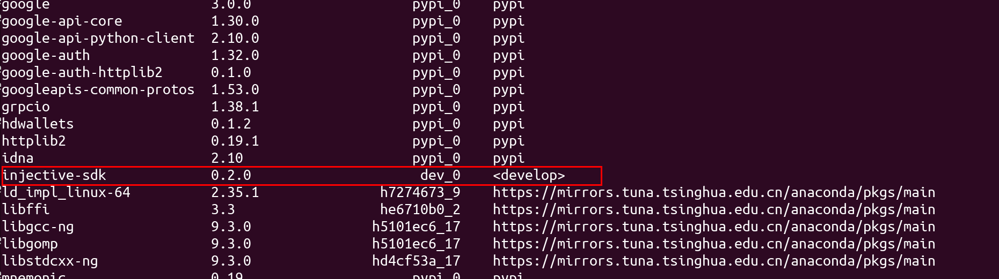
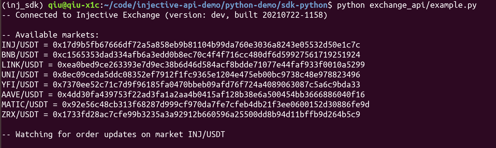
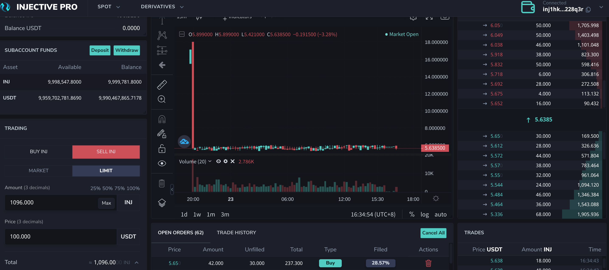

# python _sdk_demo

| Time       | Author | Email                        |
| ---------- | ------ | ---------------------------- |
| 2021-07-20 | QIU    | kaitao@injectiveprotocol.com |


[toc]

## Prerequisite

python 3.9

### Install injective python_sdk package

download the inj_python_sdk, and install the package.

 ```
 cd /path/to/python_sdk
 python setup.py build
 python setup.py install
 ```

Then, you will find `injective-sdk` in your python interpreter.



## How to run example in sdk_python

```bash
cd /path/to/sdk_python
python exchange/api.py # python 3.9
```

And you can see the avaliable markets from terminal, and the hexadecimal string is the **market id** which may be useful for connecting to market and send requests.



Then, you can send an order in your dex front-end(default address is localhost:3000).



### MarketRequest

```bash
$ cd /path/to/InjectiveSpotExchangeRPC && python 1_MarketRequest.py
Return:

-- Connected to Injective Exchange (version: dev, built 20210722-1158)

-- Available markets:
INJ/USDT = 0x17d9b5fb67666df72a5a858eb9b81104b99da760e3036a8243e05532d50e1c7c
BNB/USDT = 0xc1565353dad334afb6a3edd0b8ec70c4f4f716cc480df6d59927561719251924
LINK/USDT = 0xea0bed9ce263393e7d9ec38b6d46d584acf8bdde71077e44faf933f0010a5299
UNI/USDT = 0x8ec09ceda5ddc08352ef7912f1fc9365e1204e475eb00bc9738c48e978823496
YFI/USDT = 0x7370ee52c71c7d9f96185fa0470bbeb09afd76f724a4089063087c5a6c9bda33
AAVE/USDT = 0x4dd30fa439753f22ad3fa1a2aa4b0415af128b38e6a500454bb3666886040f16
MATIC/USDT = 0x92e56c48cb313f68287d999cf970da7fe7cfeb4db21f3ee0600152d30886fe9d
ZRX/USDT = 0x1733fd28ac7cfe99b3235a3a92912b660596a25500dd8b94d11bffb9d264b5c9

 API Response  


-- Order Update: market {
  market_id: "0x17d9b5fb67666df72a5a858eb9b81104b99da760e3036a8243e05532d50e1c7c"
  market_status: "active"
  ticker: "INJ/USDT"
  base_denom: "inj"
  base_token_meta {
    name: "Injective Protocol"
    address: "0xe28b3B32B6c345A34Ff64674606124Dd5Aceca30"
    symbol: "INJ"
    logo: "https://static.alchemyapi.io/images/assets/7226.png"
    decimals: 18
    updated_at: 1627028080464
  }
  quote_denom: "peggy0x69efCB62D98f4a6ff5a0b0CFaa4AAbB122e85e08"
  quote_token_meta {
    name: "Tether"
    address: "0x69efCB62D98f4a6ff5a0b0CFaa4AAbB122e85e08"
    symbol: "USDT"
    logo: "https://static.alchemyapi.io/images/assets/825.png"
    decimals: 6
    updated_at: 1627028080378
  }
  maker_fee_rate: "0.001"
  taker_fee_rate: "0.002"
  service_provider_fee: "0.4"
  min_price_tick_size: "0.000000000000001"
  min_quantity_tick_size: "1000000000000000"
}
```

### MarketRequests

Return requests of the whole market trading pairs at one time.

Similar to  

> MarketRequest


## How to run demo

Modify environment value in `market_making_demo.json`

```bash
python pure_market_making_demo.py
```

## What does demo do

Demo with default json setting is a simple **INJUSDT** pure market-making strategy, which places several orders at the price of 1% above and below the `mid_price`(`mid_price = (bid_price_1 + ask_price_1)/2`), and then cancel all orders and replace them according to new `mid_price` every 10s.


So far, implemented trasanction-related functions include `send_limit_order`, `cancel_order`, `semd_limit_order_in_batch`, `cancel_order_in_batch`.You can add more features in `sdk_python/chain_client/_transactions.py` according to the source code of repo`injective-core`. And we will add more features and update `sdk-python` once it has be done.

## Suggestions

Feel free to contact me when you have some errors.

And there are a few suggestions on how to report demo or API  issues.

1. before creating any issue, please make sure it is not a duplicate from existing ones
2. open an issue from injective-exchange `injective_api_demo` directly and label these issues properly with (bugs, enhancement, features, etc), and mentioned `python_demo` in title.
3. for each issue, please explain what is the issue, how to reproduce it, and present enough proofs (logs, screen shots, raw responses, etc)
4. let's always go extra one mile when reporting any issues since developer will likely spend more time on fixing those.
