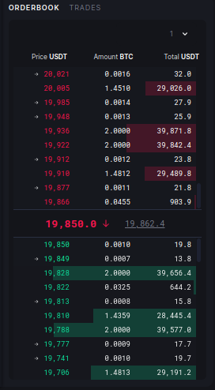

# Avellaneda Stoikov HFT Market Making BOT
| Parameter                 | Description |
| :---                      |    :----   |
| limit_horizon             | finite horizon market making or infinite horizon market making    |
| update_interval           | how often do we want to update our orders                         |
| position_max              | maximum allowed position                                          |
| sigma                     | market volatility                                                 |
| kappa                     | order filling rate                                                |
| gamma                     | our risk averseness towards inventory                                                   |
| dt                        | time step                                                         |
| T                         | Total time of market market, only matters if we choose to market making in finite horizon                                    |
| n_orders                  | number of orders on each side                                     |
| available_balance         | total balance for market making                                   |
| first_order_delta         | highest bid price or lowest ask price that is allowed minimum distance from tob  |
| last_order_delta          | lowest bid price and highest ask price that is allowed maximum distance from tob |
| ask_total_asset_allocation| percentage of available balance allocated to ask side                            |
| bid_total_asset_allocation| percentage of available balance allocated to bid side                            |
| first_asset_allocation    | extra relative weights of the first order asset allocation to other orders asset allocation |
| last_asset_allocation     | relative weights of the last order asset allocation to first orders asset allocation|
| estimated_fee_ratio       | estimated trading fee as percentage of order value                |

High-frequency trading in a limit order book, Marco Avellaneda & Sasha Stoikov

[paper url](https://www.researchgate.net/publication/24086205_High_Frequency_Trading_in_a_Limit_Order_Book).

### Some related discussions about the model:

[Parameter fitting](https://quant.stackexchange.com/questions/36073/how-does-one-calibrate-lambda-in-a-avellaneda-stoikov-market-making-problem)

[Model limitations](https://quant.stackexchange.com/questions/36400/avellaneda-stoikov-market-making-model)

